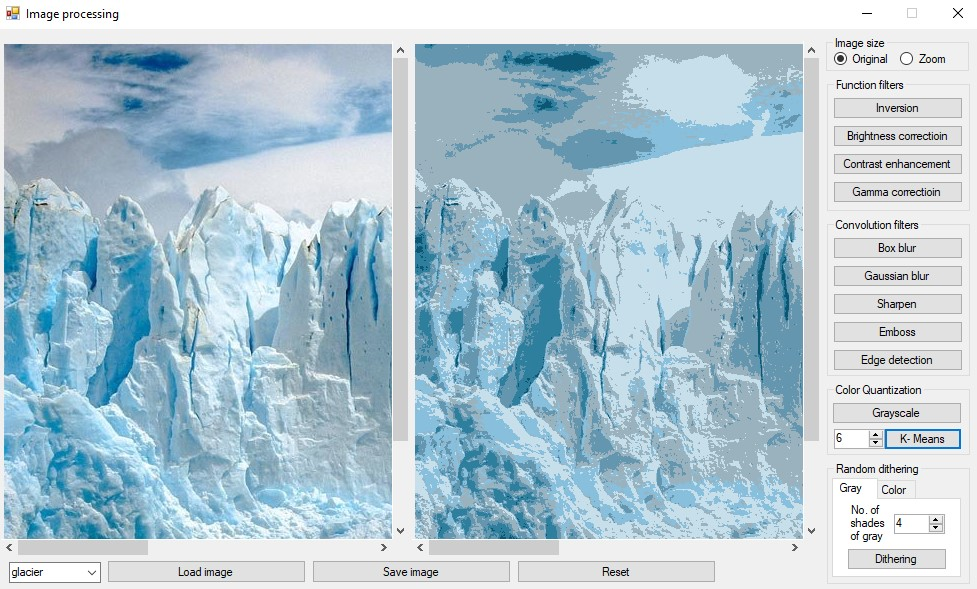

# Image processing
Image editor with the following selected filters.
## Features

- Function filters: 
    - Inversion 
    - Brightness correction 
    - Contrast enhancement 
    - Gamma correction
- Convolution filters:
    - Box blur
    - Gaussian blur
    - Sharpen
    - Emboss
    - Edge detection
- Grayscale
- Color Quantization: 
    - k-means algorithm
- Random Dithering:
    - k graylevels for grayscale
    - R G B values for color dithering

Result for K-means color quantization with 10 clusters:

 
 
